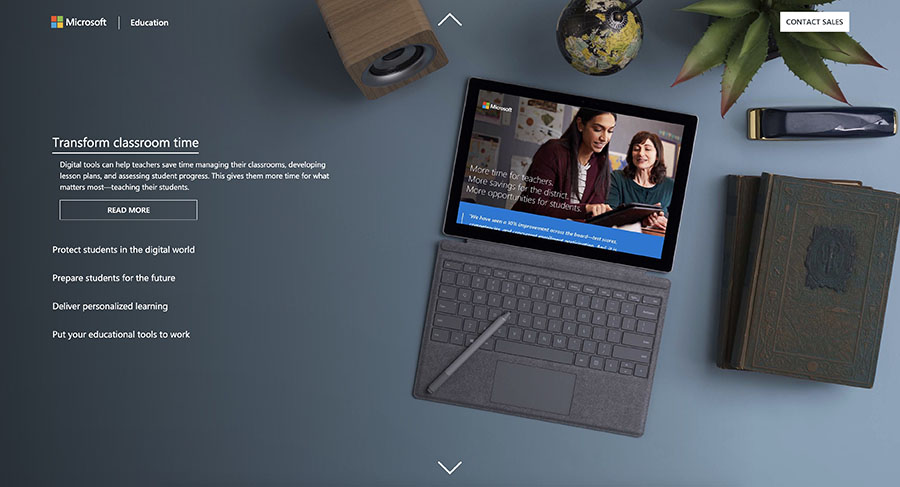
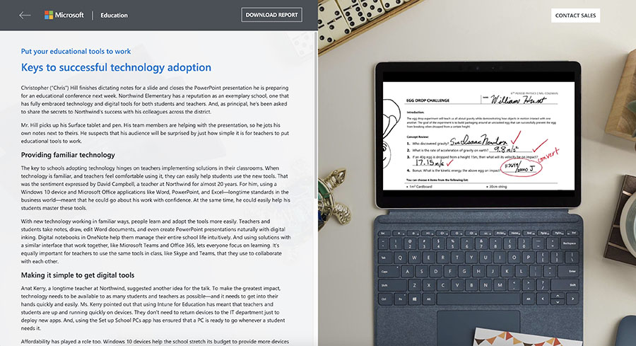
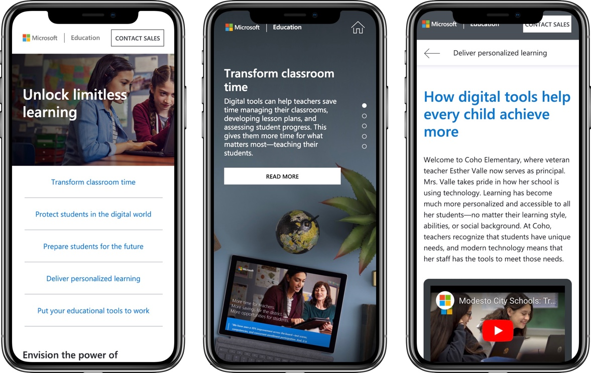

##### Description
As part of Microsoft's Global Engagement Program campaign, our team at Indigo Slate created a series of e-books to showcase how Microsoft's products and services transform classrooms across the country. In addition to the e-books, the team at Microsoft wanted an interactive website that would serve a mini version of the e-books. 

##### My Role
I worked closely with stakeholders at Microsoft and a designer to prototype interactions and eventually build out the production site UI.

##### Technologies
HTML, SCSS, JavaScript, Vue.js