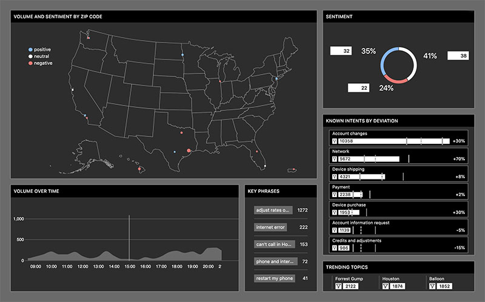

##### Description
An internal dashboard for T-Mobile’s customer support team that displays real-time conversation data processed by machine learning. The dashboard is intended to be viewed on several large TV screens throughout T-Mobile's customer support center and alert customer support reps of any abnormal activity across T-Mobile's network (such as service outage).

##### My Role
As a lead UI engineer, I worked closely with a team of machine learning engineers from T-Mobile to get sample data sets, which I accessed via REST API. Then, I collaborated with a UI designer to prototype data visualizations leading up to the final UI build and deployment.

##### Technologies
HTML, SCSS, JavaScript, Vue.js, D3