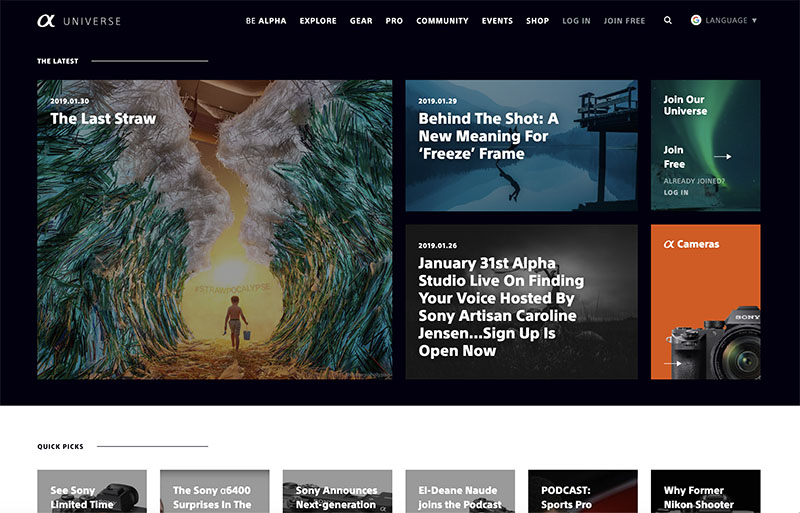
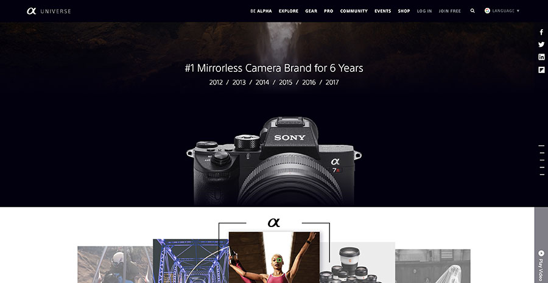
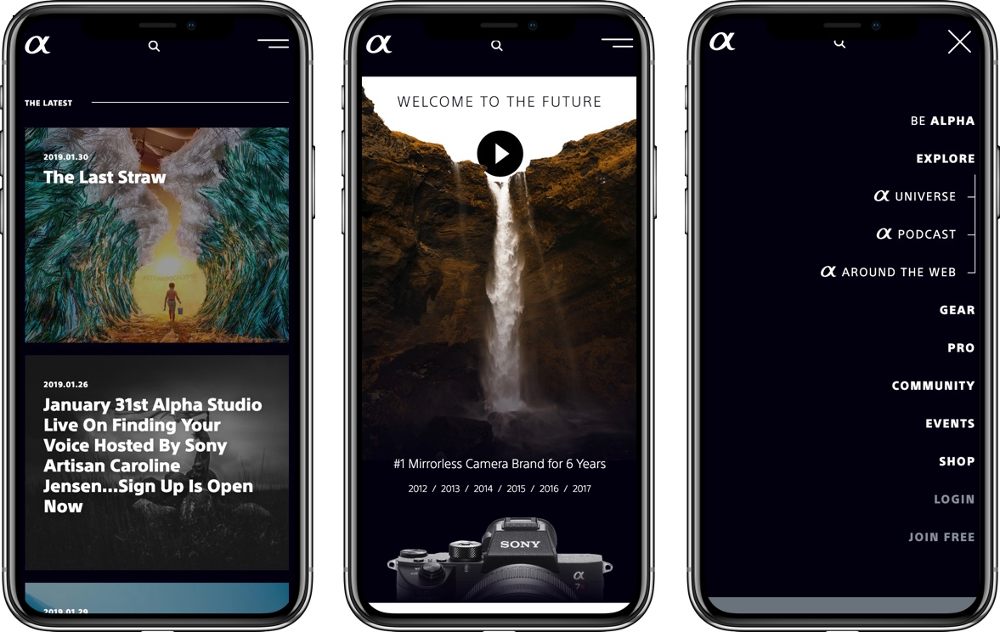

##### Description
Sony's Alpha camera brand has had a strong presence in the photography community for a long time. Likewise, the Alpha Universe online community has been thriving and recently Sony decided to refresh the Alpha Universe website and add additional features.

##### My Role
As a UI Engineer lead on this project I worked with a team of 2 UI designers and 2 UI engineers to implement a design system and a component library- which we later used to build out the individual pages of the newly redesigned alphauniverse.com. Additionally, I was in charge of implementing a key user profile/registration feature that allows visitors to authenticate into the site.

##### Technologies
HTML, SCSS, JavaScript, AngularJS, jQuery